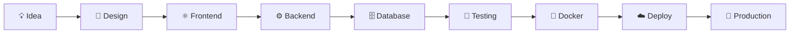

# 👋 Hey, I'm YOUR_USERNAME

### 🚀 Full-Stack Developer • Software Engineer • AI/ML Enthusiast

<p align="center">
  
</p>

<p align="center">
  <a href="https://github.com/YOUR_USERNAME">
    
  </a>
  <a href="https://github.com/YOUR_USERNAME?tab=followers">
    
  </a>
</p>

---

# ⚡ Tech Stack

### 💻 Languages

<p align="center">
  
</p>

### 🎨 Frontend

<p align="center">
  
</p>

### ⚙️ Backend

<p align="center">
  
</p>

### 🗄️ Databases & ORM

<p align="center">
  
</p>

### 🤖 AI / Machine Learning

<p align="center">
  
</p>

### 📊 Data Science

<p align="center">
  
</p>

### ☁️ DevOps & Tools

<p align="center">
  
</p>

---

# 🚀 Featured Projects

<p align="center">
  <a href="https://YOUR-PROJECT-1.vercel.app">
    
  </a>
  <a href="https://YOUR-PROJECT-2.vercel.app">
    
  </a>
</p>

### 🌐 Live Projects

| Project        | Live Demo                                       | Source                                                  |
| -------------- | ----------------------------------------------- | ------------------------------------------------------- |
| 🚀 Project One | [Live Demo](https://YOUR-PROJECT-1.vercel.app)  | [GitHub](https://github.com/YOUR_USERNAME/YOUR_REPO_1)  |
| ⚡ Project Two  | [Live Demo](https://YOUR-PROJECT-2.vercel.app)  | [GitHub](https://github.com/YOUR_USERNAME/YOUR_REPO_2)  |
| 🤖 AI Project  | [Live Demo](https://YOUR-AI-PROJECT.vercel.app) | [GitHub](https://github.com/YOUR_USERNAME/YOUR_AI_REPO) |

---

# 📊 GitHub Analytics

<p align="center">
  
  
</p>

---

# 🔥 Contribution Streak

<p align="center">
  
</p>

---

# 🏆 GitHub Trophies

<p align="center">
  
</p>

---

# 📈 Contribution Graph

<p align="center">
  
</p>

---

# 🧠 What I Like Building

```text
╔══════════════════════════════════════════════╗
║                                              ║
║   🌐 Full-Stack Web Applications             ║
║   ⚡ High Performance Frontend               ║
║   🧩 Scalable Backend Systems                ║
║   🤖 AI / ML Applications                    ║
║   🔐 Secure APIs & Authentication             ║
║   ☁️ Cloud & DevOps Solutions                ║
║   📊 Data Driven Applications                ║
║   🚀 Developer Tools & SaaS                  ║
║                                              ║
╚══════════════════════════════════════════════╝
```

---

# 🛠️ My Development Workflow



---

# 📚 Currently Exploring

* 🧠 Advanced AI / Machine Learning
* ⚡ Next.js & Modern React Architecture
* 🏗️ Scalable Backend Architecture
* ☁️ Cloud & DevOps
* 🐳 Docker & Kubernetes
* 🔐 Authentication & Application Security
* 📊 Data Engineering & Analytics
* 🚀 System Design

---

# 🤝 Let's Connect

<p align="center">
  <a href="https://github.com/YOUR_USERNAME">
    
  </a>
  <a href="https://www.linkedin.com/in/YOUR_LINKEDIN">
    
  </a>
  <a href="mailto:YOUR_EMAIL@example.com">
    
  </a>
  <a href="https://YOUR-PORTFOLIO.vercel.app">
    
  </a>
</p>

---

# ☕ Support My Work

<p align="center">
  <a href="https://github.com/YOUR_USERNAME">
    
  </a>
</p>

<p align="center">
  <b>💻 Code. Build. Learn. Repeat. 🚀</b>
</p>

<p align="center">
  <i>"The best way to predict the future is to build it."</i>
</p>

---

<p align="center">
  
</p>
